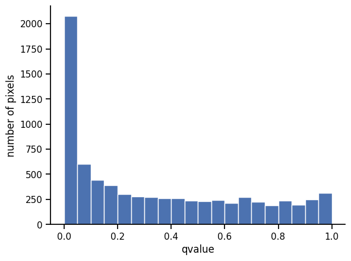
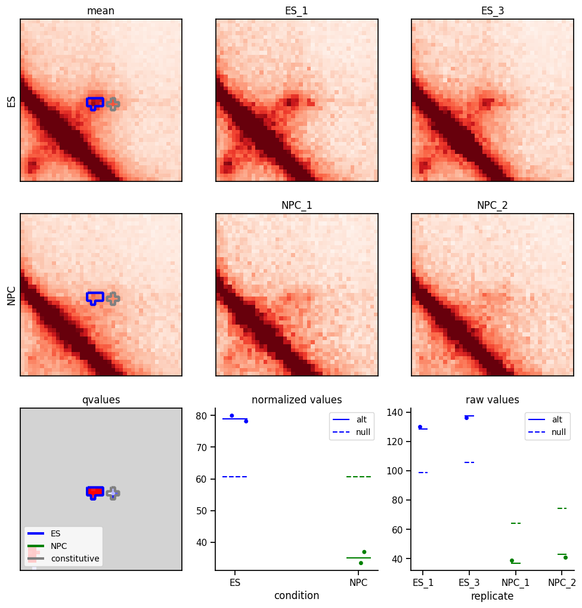

fast3defdr
==========

a genome-scale differential loop finder

Installation
------------

We require Python 2.7 and the dependencies listed in `setup.py`.

Currently, we depend on `hiclite>=0.0.2` which is not on PyPi and therefore must
be installed manually.

A typical install process should be:

    $ git clone https://<username>@bitbucket.org/creminslab/fast3defdr.git
    $ cd fast3defdr
    $ virtualenv venv
    $ source venv/bin/activate
    (venv)$ pip install numpy
    (venv)$ pip install https://www.dropbox.com/s/478tfs7osyzwro7/hiclite-0.0.2-py2-none-any.whl?dl=1
    (venv)$ pip install -e .  # for dev mode install (currently recommended)

If installation succeeded then `fast3defdr.Fast3DeFDR` should be importable from
an interactive shell started in some other directory:

    (venv)$ cd <some other directory>
    (venv)$ python
    >>> from fast3defdr import Fast3DeFDR

Basic walkthrough
-----------------

To analyze the ES_1, ES_3, NPC_2, and NPC_4 reps of the Bonev dataset with
default parameters, we would first describe the dataset in terms of replicate
names, chromosome names, and a design matrix:

    >>> import pandas as pd
    >>>
    >>> repnames = ['ES_1', 'ES_3', 'NPC_2', 'NPC_4']
    >>> chroms = ['chr%i' % i for i in range(1, 20)] + ['chrX']
    >>> design = pd.DataFrame({'ES': [1, 1, 0, 0], 'NPC': [0, 0, 1, 1]},
    ...                       dtype=bool, index=repnames)

We would next describe the location of input data files (raw contact matrices in
`scipy.sparse` NPZ format, bias vectors in plain-text `np.savetxt()` format,
and loop cluster files in sparse JSON format) and use those to construct a
`Fast3DeFDR` object:

    >>> from fast3defdr import Fast3DeFDR
    >>>
    >>> base_path = '...'
    >>> f = Fast3DeFDR(
    ...     raw_npz_patterns=[base_path + '<rep>/<chrom>_raw.npz'.replace('<rep>', repname) for repname in repnames],
    ...     bias_patterns=[base_path + '<rep>/<chrom>_kr.bias'.replace('<rep>', repname) for repname in repnames],
    ...     chroms=chroms,
    ...     design=design,
    ...     outdir='output',
    ...     loop_patterns=[base_path + 'clusters/%s_<chrom>.json' % c for c in ['ES', 'NPC']]
    ... )

This object saves itself to disk, so it can be re-loaded at any time

    >>> f = Fast3DeFDR.load('output')

We can then process the data through the p-values stage either
chromosome-by-chromosome:

    >>> f.process_chrom('chr19')

or for all chromosomes at once:

    >>> f.process_all()

After p-values have been computed, we can apply BH-FDR correction to obtain
q-values:

    >>> f.bh()

We can then threshold and cluster the significantly differential loops

    >>> f.threshold_all(fdr=0.05, cluster_size=4)

We can also sweep across FDR and/or cluster size thresholds:

    >>> f.threshold_all(fdr=[0.01, 0.05], cluster_size=[4, 5])

The complete analysis should take about 10 minutes on a laptop and fit
comfortably in memory.

Intermediates and final output files
------------------------------------

All intermediates used in the computation will be saved to the disk in the
`outdir` folder.

TODO: describe the intermediates

TODO: add a tsv-style output file

Visualizations
--------------

The `Fast3DeFDR` object can be used to draw visualizations of the analysis.

### Distance dependence curves before and after scaling

    >>> f.plot_dd_curve('chr1', outfile='dd.png')

### Dispersion fitting

    >>> f.plot_dispersion_fit('chr1', outfile='disp.png')

### P-value distribution

    >>> f.plot_pvalue_distribution(outfile='pvalue_dist.png')

### Q-value distribution

    >>> f.plot_qvalue_distribution(outfile='qvalue_dist.png')

### Pixel detail grid

    >>> f.plot_grid('chr1', 1303, 1312, 50, outfile='grid.png')

The upper right heatmaps show the balanced and scaled values in each replicate,
with each condition on its own row.

The upper left heatmaps show the alternative model mean parameter estimates for
each condition. Significantly differential clusters are purple while
constitutive ones are gray.

The lower left heatmap shows the q-values. Significantly differential clusters
are orange while constitutive ones are gray.

The stripplots in the lower left show details information about the specific
pixel in the center of the heatmaps (in this example `(1303, 1312)`). The dots
show the values at that pixel for each replicate in normalized and raw space,
repsectively. The solid and dashed lines represent the mean parameters under the
alt and null models, repsectively.

Green points in the heatmaps represent points that have been filtered out. For
the per-replicate heatmaps in the upper right of the grid, the only filters
applied are the zero filter, bias filter, and distance filter. For the alt model
mean heatmaps in the upper left, this additionally includes the dispersion
filter. For the q-value heatmap in the lower left, it additionally includes the
loop filter if loop locations were supplied.
