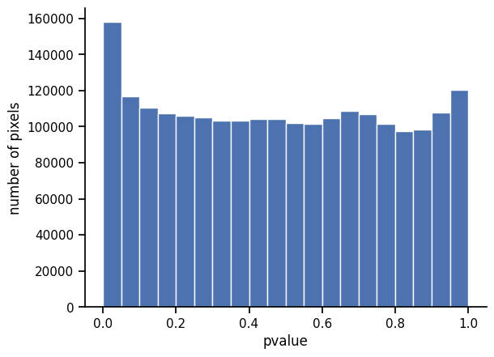

fast3defdr
==========

a genome-scale differential loop finder

Installation
------------

We require Python 2.7 and the dependencies listed in `setup.py`.

A typical quick install process should be:

    $ virtualenv venv
    $ source venv/bin/activate
    (venv)$ pip install numpy
    (venv)$ pip install git+https://<username>@bitbucket.org/creminslab/fast3defdr.git

A typical dev-mode install process should be:

    $ git clone https://<username>@bitbucket.org/creminslab/fast3defdr.git
    $ cd fast3defdr
    $ virtualenv venv
    $ source venv/bin/activate
    (venv)$ pip install numpy
    (venv)$ pip install -e .

If installation succeeded then `fast3defdr.Fast3DeFDR` should be importable from
an interactive shell started in some other directory:

    (venv)$ cd <some other directory>
    (venv)$ python
    >>> from fast3defdr import Fast3DeFDR

Basic walkthrough
-----------------

To analyze the ES_1, ES_3, NPC_2, and NPC_4 reps of the dataset dataset from
[Bonev et al. 2017](https://www.ncbi.nlm.nih.gov/pubmed/29053968) with default
parameters, we would first describe the dataset in terms of replicate names,
chromosome names, and a design matrix. We will just analyze chromosomes 18 and
19 here for illustrative purposes.

    >>> import pandas as pd
    >>>
    >>> repnames = ['ES_1', 'ES_3', 'NPC_2', 'NPC_4']
    >>> #chroms = ['chr%i' % i for i in range(1, 20)] + ['chrX']
    >>> chroms = ['chr18', 'chr19']
    >>> design = pd.DataFrame({'ES': [1, 1, 0, 0], 'NPC': [0, 0, 1, 1]},
    ...                       dtype=bool, index=repnames)

If you're following along, you can download the data like this:

    $ mkdir -p ~/data/bonev
    $ wget -qO- -O tmp.zip https://www.dropbox.com/sh/hvoyhjc00m24o6m/AAAci5qaxsn7o9W-gToAeBiza?dl=1 && unzip tmp.zip -x / -d ~/data/bonev && rm tmp.zip

The required input files consist of:

 - raw contact matrices in `scipy.sparse` NPZ format,
 - bias vectors in plain-text `np.savetxt()` format, and
 - loop cluster files in sparse JSON format, specifying the locations of loops
   present in each condition

We would next describe the location of the input data files and use those to
construct a `Fast3DeFDR` object:

    >>> import os.path
    >>> from fast3defdr import Fast3DeFDR
    >>>
    >>> base_path = os.path.expanduser('~/data/bonev/')
    >>> f = Fast3DeFDR(
    ...     raw_npz_patterns=[base_path + '<rep>/<chrom>_raw.npz'.replace('<rep>', repname) for repname in repnames],
    ...     bias_patterns=[base_path + '<rep>/<chrom>_kr.bias'.replace('<rep>', repname) for repname in repnames],
    ...     chroms=chroms,
    ...     design=design,
    ...     outdir='output',
    ...     loop_patterns={c: base_path + 'clusters/%s_<chrom>_clusters.json' % c for c in ['ES', 'NPC']}
    ... )
    creating directory output

This object saves itself to disk, so it can be re-loaded at any time:

    >>> f = Fast3DeFDR.load('output')

To run the analysis for all chromosomes through q-values, run:

    >>> f.run_to_qvalues()

To threshold, cluster, and classify the significantly differential loops, run:

    >>> f.classify()

Step-by-step walkthrough
------------------------

We prepare the input data and compute the size factors with:

    >>> f.prepare_data()

We estimate dispersions with:

    >>> f.estimate_disp()

By default, dispersion will be estimated as a function of the pixel-wise
normalized mean. To fit dispersion as a function of distance instead, pass
`trend='dist'`.

We perform the likelihood ratio test to obtain p-values with:

    >>> f.lrt()

We apply BH-FDR correction to the p-values across all chromosomes to obtain 
q-values:

    >>> f.bh()

We threshold, cluster, and classify the significantly differential loops:

    >>> f.classify(fdr=0.05, cluster_size=3)

We can also sweep across FDR and/or cluster size thresholds:

    >>> f.classify(fdr=[0.01, 0.05], cluster_size=[3, 4])

`f.classify()` calls `f.threshold()` automatically for FDR and cluster size 
thresholds that have not been run yet. `f.threshold()` is the step that performs 
thresholding and clustering but not classification.

The complete analysis of these four specific replicates of the Bonev et al.
dataset should take about 10 minutes on a laptop if run for all chromosomes,
fitting comfortably in memory.

Intermediates and final output files
------------------------------------

All intermediates used in the computation will be saved to the disk inside the
`outdir` folder as `<intermediate>_<chrom>.npy` (most intermediates),
`<intermediate>_<chrom>.json` (thresholded or classified clusters), or
`<intermediate>_<chrom>.pickle` (estimated dispersion functions).

| Step              | Intermediate    | Shape                       | Description                                 |
|-------------------|-----------------|-----------------------------|---------------------------------------------|
| `prepare_data()`  | `row`           | `(n_pixels,)`               | Top-level row index                         |
| `prepare_data()`  | `col`           | `(n_pixels,)`               | Top-level column index                      |
| `prepare_data()`  | `bias`          | `(n_bins, n_reps)`          | Bias vectors                                |
| `prepare_data()`  | `raw`           | `(n_pixels, n_reps)`        | Raw count values                            |
| `prepare_data()`  | `size_factors`  | `(n_reps,)`                 | Size factors                                |
| `prepare_data()`  | `scaled`        | `(n_pixels, n_reps)`        | Normalized count values                     |
| `estimate_disp()` | `disp_idx`      | `(n_pixels,)`               | Marks pixels for which dispersion is fitted |
| `estimate_disp()` | `cov_per_bin`   | `(n_bins, n_conds)`         | Average mean count or distance in each bin  |
| `estimate_disp()` | `disp_per_bin`  | `(n_bins, n_conds)`         | Pooled dispersion estimates in each bin     |
| `estimate_disp()` | `disp_fn_<c>`   | pickled function            | Fitted dispersion function                  |
| `estimate_disp()` | `disp`          | `(disp_idx.sum(), n_conds)` | Smoothed dispersion estimates               |
| `lrt()`           | `mu_hat_null`   | `(disp_idx.sum(),)`         | Null model mean parameters                  |
| `lrt()`           | `mu_hat_alt`    | `(disp_idx.sum(), n_conds)` | Alternative model mean parameters           |
| `lrt()`           | `llr`           | `(disp_idx.sum(),)`         | Log-likelihood ratio                        |
| `lrt()`           | `pvalues`       | `(disp_idx.sum(),)`         | LRT-based p-value                           |
| `lrt()`           | `loop_idx`      | `(disp_idx.sum(),)`         | Marks pixels which lie in loops             |
| `bh()`            | `qvalues`       | `(loop_idx.sum(),)`         | BH-corrected q-values                       |
| `threshold()`     | `sig_<f>_<s>`   | JSON                        | Significantly differential clusters         |
| `threshold()`     | `insig_<f>_<s>` | JSON                        | Constitutive clusters                       |
| `classify()`      | `<c>_<f>_<s>`   | JSON                        | Classified differential clusters            |

The table uses these abbreviations to refer to variable parts of certain 
intermediate names:

 - `<f>`: FDR threshold
 - `<s>`: cluster size threshold
 - `<c>`: condition/class label

TODO: add a tsv-style output file

Visualizations
--------------

The `Fast3DeFDR` object can be used to draw visualizations of the analysis.

### Distance dependence curves before and after scaling

    >>> _ = f.plot_dd_curves('chr18', outfile='dd.png')

### Dispersion fitting

    >>> _ = f.plot_dispersion_fit('chr18', 'ES', outfile='var.png')

You can also plot the y-axis in units of dispersion by plotting `yaxis='disp'`.

If dispersion was fitted against distance rather than mean, pass `xaxis='dist'`
to plot dispersion/variance versus distance.

You can also draw the dispersion point cloud against the `xaxis` (either
`'dist'` or `'mean'`) you didn't use for fitting, but you should also pass
`scatter_fit=0` to skip trying to plot the smoothed curve in a space it was
not fitted in or `scatter_fit=100` to plot the estimated dispersions/variances
for 100 selected points as a scatterplot.

### P-value distribution

    >>> _ = f.plot_pvalue_distribution(outfile='pvalue_dist.png')

By default, this plots the p-value distribution over all pixels for which
dispersion was estimated. To plot the p-value distribution only over points in
loops, pass `idx='loop'`.

### Q-value distribution

    >>> _ = f.plot_qvalue_distribution(outfile='qvalue_dist.png')

### Pixel detail grid

    >>> _ = f.plot_grid('chr18', 2218, 2236, 50, outfile='grid.png')

The upper right heatmaps show the balanced and scaled values in each replicate,
with each condition on its own row.

The upper left heatmaps show the alternative model mean parameter estimates for
each condition. Significantly differential clusters are purple while
constitutive ones are gray.

The lower left heatmap shows the q-values. Significantly differential clusters
are orange while constitutive ones are gray.

The stripplots in the lower left show details information about the specific
pixel in the center of the heatmaps (in this example `(2218, 2236)`). The dots
show the values at that pixel for each replicate in normalized and raw space,
repsectively. The solid and dashed lines represent the mean parameters under the
alt and null models, repsectively.

Green points in the heatmaps represent points that have been filtered out. For
the per-replicate heatmaps in the upper right of the grid, the only filters
applied are the zero filter, bias filter, and distance filter. For the alt model
mean heatmaps in the upper left, this additionally includes the dispersion
filter. For the q-value heatmap in the lower left, it additionally includes the
loop filter if loop locations were supplied.

### Interactive thresholding

In a Jupyter notebook environment with `ipywidgets` installed, you can play with
thresholds on a live-updating plot by running:

    %matplotlib notebook

    from ipywidgets import interact
    from fast3defdr import Fast3DeFDR
    
    f = Fast3DeFDR.load('output')
    _, _, outline_clusters = f.plot_grid('chr18', 2218, 2236, 50)
    _ = interact(outline_clusters, fdr=[0.01, 0.05, 0.1, 0.2],
                 cluster_size=[3, 4])

Simulation
----------

After the `estimate_disp()` step has been run, a Fast3DeFDR object with exactly
two conditions and an equal number of replicates per condition can be used to
generate simulations of differential looping.

### Generating simulations

To create an ES-based simulation over all chromosomes listed in `f.chroms`, we
run

    >>> from fast3defdr import Fast3DeFDR
    >>>
    >>> f = Fast3DeFDR.load('output')
    >>> f.simulate('ES')
    creating directory sim

If we passed `trend='dist'` to `f.estimate_disp()`, we need to pass it to
`f.simulate()` as well to ensure that the simulation function knows to treat
the previously-fitted dispersion function as a function of distance.

This takes the mean of the real scaled data across the ES replicates and
perturbs the loops specified in `f.loop_patterns['ES']` up or down at random to
generate two new conditions called "A" and "B". The scaled mean matrices for
these conditions are then biased and scaled by the bias vectors and size
factors taken from the real data, and the ES dispersion function fitted to the
real ES data is applied to the biased and scaled means to obtain dispersion
values. These means and dispersions are used to draw an NB random variable for
each pixel of each simulated replicate. The number of replicates in each of the
simulated conditions "A" and "B" will match the design of the real analysis.

The simulated raw contact matrices will be written to disk in CSR format as
`<cond><rep>_<chrom>_raw.npz` where `<cond>` is "A" or "B" and `<rep>` is the
rep number within the condition. The design matrix will also be written to disk
as `design.csv`.

The true labels used to perturb the loops will also be written to disk as
`labels_<chrom>.txt`. This file contains as many lines as there are clusters in
`f.loop_patterns['ES']`, with the `i`th line providing the label for the `i`th
cluster. This file can be loaded with `np.loadtxt(..., dtype='|S7')`.

### Evaluating simulations

After generating simulated data, Fast3DeFDR can be run on the simulated data.
Then, the true labels can be used to evaluate the performance of Fast3DeFDR on
the simulated data.

Evaluation of simulated data requires scikit-learn. To install this package,
run

    (venv)$ pip install scikit-learn

In order to run Fast3DeFDR on the simulated data, we first need to balance the
simulated raw contact matrices to obtain bias vectors for each simulated
replicate and chromosome. We will assume are saved next to the raw contact
matrices and named `<rep>_<chrom>_kr.bias`. One example of how this can be done
is to use the [hiclite library](https://bitbucket.org/creminslab/hiclite) and
the following script:

    >>> import sys
    >>>
    >>> import numpy as np
    >>> import scipy.sparse as sparse
    >>>
    >>> from hiclite.steps.filter import filter_sparse_rows_count
    >>> from hiclite.steps.balance import kr_balance
    >>>
    >>>
    >>> infile_pattern = 'sim/<rep>_<chrom>_raw.npz'
    >>> repnames = ['A1', 'A2', 'B1', 'B2']
    >>> chroms = ['chr18', 'chr19']
    >>>
    >>> for repname in repnames:
    ...     for chrom in chroms:
    ...         sys.stderr.write('balancing rep %s chrom %s\n' % (repname, chrom))
    ...         infile = infile_pattern.replace('<rep>', repname)\
    ...             .replace('<chrom>', chrom)
    ...         outfile = infile.replace('_raw.npz', '_kr.bias')
    ...         _, bias, _ = kr_balance(
    ...             filter_sparse_rows_count(sparse.load_npz(infile)), fl=0)
    ...         np.savetxt(outfile, bias)

Next, we create a new Fast3DeFDR object to analyze the simulated data and run
the analysis through to q-values:

    >>> import os.path
    >>> from fast3defdr import Fast3DeFDR
    >>>
    >>> repnames = ['A1', 'A2', 'B1', 'B2']
    >>> chroms = ['chr18', 'chr19']
    >>> sim_path = 'sim/'
    >>> base_path = os.path.expanduser('~/data/bonev/')
    >>> f_sim = Fast3DeFDR(
    ...     raw_npz_patterns=[sim_path + '<rep>_<chrom>_raw.npz'.replace('<rep>', repname) for repname in repnames],
    ...     bias_patterns=[sim_path + '<rep>_<chrom>_kr.bias'.replace('<rep>', repname) for repname in repnames],
    ...     chroms=chroms,
    ...     design=sim_path + 'design.csv',
    ...     outdir='output-sim',
    ...     loop_patterns={'ES': base_path + 'clusters/ES_<chrom>_clusters.json'}
    ... )
    creating directory output-sim
    >>> f_sim.run_to_qvalues()

Next, we can evaluate the simulation against the clusters in
`f_sim.loop_patterns['ES']` with true labels from `sim/labels_<chrom>.txt`:

    >>> f_sim.evaluate('ES', 'sim/labels_<chrom>.txt')

This writes a file in `f_sim`'s output directory called `eval.npz`. This file
can be loaded with `np.load()` and has four keys whose values are all one
dimensional vectors:

 - `'thresh'`: the thresholds (in `1 - qvalue` space) which make up the convex
   edge of the ROC curve; all other vectors are parallel to this one
 - `'fdr'`: the observed false discovery rate at each threshold
 - `'tpr'`: the observed true positive rate at each threshold
 - `'fpr'`: the observed false positive rate at each threshold

`eval.npz` files (possibly across many runs) can be visualized as ROC curves
and FDR control curves by running:

    >>> import numpy as np
    >>> from fast3defdr import plot_roc, plot_fdr
    >>>
    >>> _ = plot_roc([np.load('output-sim/eval.npz')], ['fast3defdr'], outfile='roc.png')
    >>> _ = plot_fdr([np.load('output-sim/eval.npz')], ['fast3defdr'], outfile='fdr.png')

Multiple `eval.npz` files can be compared in the same plot by simply adding
elements to the lists in these function calls.

The ROC plot shows FPR versus TPR, with the gray diagonal line representing the
performance of random guessing. The AUROC for each curve is shown in the
legend. If only one curve is plotted, selected thresholds (in units of FDR) are
annotated with black arrows.

The FDR control plot shows the observed FDR as a function of the FDR threshold.
Points below the gray diagonal line represent points at which FDR is
successfully controlled.
