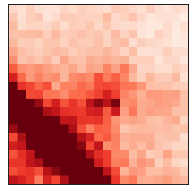
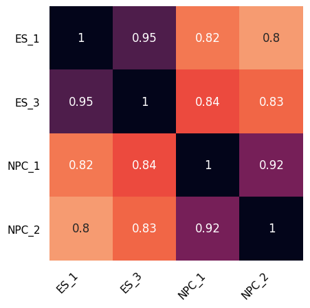
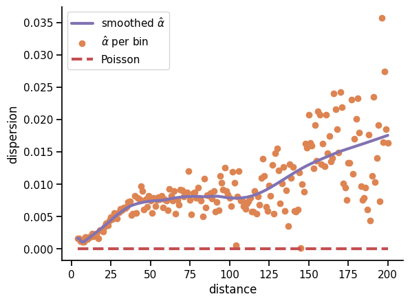
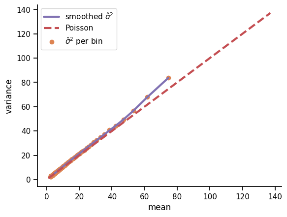
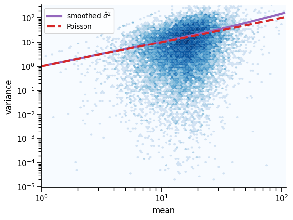
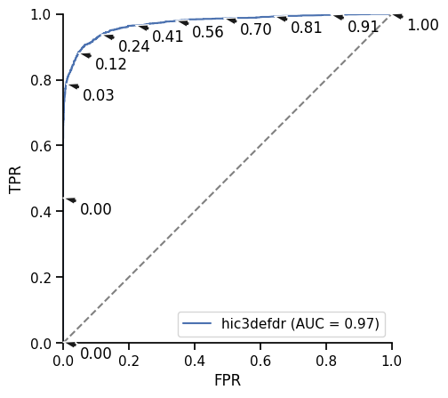

hic3defdr
=========


[](https://pypi.org/project/hic3defdr)
[](https://pypi.org/project/hic3defdr)
[](https://bitbucket.org/creminslab/3defdr-hic/addon/pipelines/home)

A genome-scale differential loop finder.

For the latest source, discussion, etc, please visit the Bitbucket repository at
https://bitbucket.org/creminslab/hic3defdr

Installation
------------

We require Python 2.7.11+ or 3.6+ and the dependencies listed in `setup.py`.

A typical quick install process should be:

    $ virtualenv venv
    $ source venv/bin/activate
    (venv)$ pip install hic3defdr

A typical dev-mode install process should be:

    $ git clone https://bitbucket.org/creminslab/hic3defdr.git
    $ cd hic3defdr
    $ virtualenv venv
    $ source venv/bin/activate
    (venv)$ pip install -e .

If installation succeeded then `hic3defdr.HiC3DeFDR` should be importable from
an interactive shell started in some other directory:

    (venv)$ cd <some other directory>
    (venv)$ python
    >>> from hic3defdr import HiC3DeFDR

### Optional dependencies

Evaluating simulations requires scikit-learn:

    (venv)$ pip install scikit-learn

To display progress bars during selected steps of the analysis, install [tqdm](https://github.com/tqdm/tqdm):

    (venv)$ pip install tqdm

Basic walkthrough
-----------------

Before we start, we'll seed numpy's random number generator for reproducibility:

    >>> import numpy as np
    >>> np.random.seed(42)

To analyze the ES_1, ES_3, NPC_1, and NPC_2 reps of the dataset dataset from
[Bonev et al. 2017](https://www.ncbi.nlm.nih.gov/pubmed/29053968) with default
parameters, we would first describe the dataset in terms of replicate names,
chromosome names, and a design matrix. We will just analyze chromosomes 18 and
19 here for illustrative purposes.

    >>> import pandas as pd
    >>>
    >>> repnames = ['ES_1', 'ES_3', 'NPC_1', 'NPC_2']
    >>> #chroms = ['chr%i' % i for i in range(1, 20)] + ['chrX']
    >>> chroms = ['chr18', 'chr19']
    >>> design = pd.DataFrame({'ES': [1, 1, 0, 0], 'NPC': [0, 0, 1, 1]},
    ...                       dtype=bool, index=repnames)

If you're following along, you can download the data like this:

    $ python -m hic3defdr.util.demo_data

or from inside an interactive shell:

    >>> from hic3defdr.util.demo_data import ensure_demo_data
    >>> ensure_demo_data()

The data will be downloaded to a folder called `hic3defdr-demo-data` under your
home directory.

The required input files consist of:

 - upper triangular, raw contact matrices in `scipy.sparse` NPZ format,
 - bias vectors in plain-text `np.savetxt()` format, and
 - loop cluster files in sparse JSON format (see below for more details),
   specifying the locations of loops present in each condition

TODO: explain how to import data from common Hi-C analysis tools into this
format

We would next describe the location of the input data files and use those to
construct a `HiC3DeFDR` object:

    >>> import os.path
    >>> from hic3defdr import HiC3DeFDR
    >>>
    >>> base_path = os.path.expanduser('~/hic3defdr-demo-data/')
    >>> h = HiC3DeFDR(
    ...     raw_npz_patterns=[base_path + '<rep>/<chrom>_raw.npz'.replace('<rep>', repname) for repname in repnames],
    ...     bias_patterns=[base_path + '<rep>/<chrom>_kr.bias'.replace('<rep>', repname) for repname in repnames],
    ...     chroms=chroms,
    ...     design=design,
    ...     outdir='output',
    ...     loop_patterns={c: base_path + 'clusters/%s_<chrom>_clusters.json' % c for c in ['ES', 'NPC']},
    ...     res=10000
    ... )
    creating directory output

This object saves itself to disk, so it can be re-loaded at any time:

    >>> h = HiC3DeFDR.load('output')

To run the analysis for all chromosomes through q-values, run:

    >>> h.run_to_qvalues()

To threshold, cluster, and classify the significantly differential loops, and
collect all the results into a single TSV output file, run:

    >>> h.collect()

The output file will be written to `output/results_0.01_3.tsv`, where "output"
refers to the `outdir` we passed when constructing the `HiC3DeFDR` object,
"0.01" refers to the default FDR of 1%, and "3" refers to the default cluster
size threshold of 3.

    >>> import pandas as pd
    >>> pd.read_csv('output/results_0.05_3.tsv', sep='\t', index_col=0).head()
                                                us_chrom  ...  classification
    loop_id                                               ...                
    chr18:3480000-3500000_chr18:4680000-4710000    chr18  ...    constitutive
    chr18:3490000-3510000_chr18:3790000-3810000    chr18  ...              ES
    chr18:3490000-3510000_chr18:3970000-3990000    chr18  ...    constitutive
    chr18:3490000-3510000_chr18:4170000-4200000    chr18  ...    constitutive
    chr18:3490000-3520000_chr18:4120000-4150000    chr18  ...    constitutive
    <BLANKLINE>
    [5 rows x 9 columns]

See the section "TSV output format" below for more details about the output
format.

Step-by-step walkthrough
------------------------

Calling `h.run_to_qvalues()` runs the four main steps of the analysis in
sequence. These four steps are described in further detail below. Any kwargs
passed to `h.run_to_qvalues()` will be passed along to the appropriate step; see
`help(HiC3DeFDR.run_to_qvalues)` for details.

### Step 1: Preparing input data

The function call `h.prepare_data()` prepares the input raw contact matrices and
bias vectors specified by `h.raw_npz_patterns` and `h.bias_patterns` for all
chromosomes specified in `h.chroms`, performs library size normalization, and
determines what points should be considered for dispersion estimation. This
creates intermediate files in the output directory `h.outdir` that represent the
raw and scaled values, as well as the estimated size factors, and a boolean
vector `disp_idx` indicating which points will be used for dispersion
estimation. If `loop_patterns` was passed to the constructor, an additional
boolean vector `loop_idx` is created to mark which points that pass `disp_idx`
lie within looping interactions specified by `h.loop_patterns`. The raw and
scaled data are stored in a rectangular matrix format where each row is a pixel
of the contact matrix and each column is a replicate. If the size factors are
estimated as a function of distance, the estimated size factors are also stored
in this format. Two separate vectors called `row` and `col` are used to store
the row and column index of the pixel represented by each row of the rectangular
matrices. Together, the `row` and `col` vectors plus any of the rectangular
matrices represent a generalization of a COO format sparse matrix to multiple
replicates (in the standard COO format the `row` and `col` vectors are
complemented by a single `value` vector).

The size factors can be estimated with a variety of methods defined in the
`hic3defdr.scaling` module. The method to use is specified by the `norm` kwarg
passed to `h.prepare_data()`. Some of these methods estimate size factors as a
function of interaction distance, instead of simply estimating one size factor
for each replicate as is common in RNA-seq differential expression analysis.
When these methods are used, the number of bins to use when binning distances
for distance-based estimation of the size factors can be specified with the
`n_bins` kwarg. The defaults for this function use the conditional median of
ratios approach (`hic3defdr.scaling.conditional_mor`) and an
automatically-selected number of bins.

### Step 2: Estimating dispersions

The function call `h.estimate_disp()` estimates the dispersion parameters at
each distance scale in the data and fits a lowess curve through the graph of
distance versus dispersion to obtain final smoothed dispersion estimates for
each pixel.

The `estimator` kwarg on `h.estimate_disp()` specifies which dispersion
estimation method to use, out of a selection of options defined in the
`hic3defdr.dispersion` module. The default is to use quantile-adjusted
conditional maximum likelihood (qCML).

### Step 3: Likelihood ratio test

The function call `h.lrt()` performs a likelihood ratio test (LRT) for each
pixel. This LRT compares a null model of no differential expression (fitting one
true mean parameter shared by all replicates irrespective of condition) to an
alternative model in which the two conditions have different true mean
parameters.

### Step 4: False discovery rate (FDR) control

The function call `h.bh()` performs Benjamini-Hochberg FDR correction on the
p-values called via the LRT in the previous step, considering only a subset of
pixels that are involved in looping interactions (as specified by
`h.loop_patterns`; if `loop_patterns` was not passed to the constructor then all
pixels are included in the BH-FDR correction). This results in final q-values
for each loop pixel.

### Thresholding, clustering, and classification

We can threshold, cluster, classify, and collect the significantly differential
loops:

    >>> h.collect(fdr=0.05, cluster_size=3)

We can also sweep across FDR and/or cluster size thresholds:

    >>> h.collect(fdr=[0.01, 0.05], cluster_size=[3, 4])

The final output file for each combination of thresholding parameters will be
written to `<h.outdir>/results_<fdr>_<cluster_size>.tsv`.

This example walkthrough should take less than 5 minutes for the two chromosomes
included in the demo data. Run time for a whole-genome analysis will depend on
parallelization as discussed in the next section.

Parallelization
---------------

The functions `run_to_qvalues()`, `prepare_data()`, `lrt()`, `threshold()`,
`classify()`, and `simulate()` operate in a per-chromosome manner. By default,
each chromosome in the dataset will be processed in series. If multiple cores
and sufficient memory are available, you can use the `n_threads` kwarg on these
functions to use multiple subprocesses to process multiple chromosomes in
parallel. Pass either a desired number of subprocesses to use, or pass
`n_threads=-1` to use all available cores. The output logged to stderr will be
truncated to reduce clutter from multiple subprocesses printing to stderr at the
same time. This truncation is controlled by the `verbose` kwarg which is
available on some of these parallelized functions.

The function `estimate_disp()` also accepts an `n_threads` kwarg, using it to
parallelize itself across distance scales.

The function `run_to_qvalues()` passes the `n_threads` kwarg through to all the
steps it calls.

Intermediates and final output files
------------------------------------

All intermediates used in the computation will be saved to the disk inside the
`outdir` folder as `<intermediate>_<chrom>.npy` (most intermediates),
`<intermediate>_<chrom>.json`/`<intermediate>_<chrom>.tsv` (thresholded or
classified clusters).

Two intermediates are not generated per chromosome. These are
`disp_fn_<c>.pickle` (dispersion function estimated across all chromosomes for
condition `<c>`) and `results_<f>_<s>.tsv` (final combined results from all
chromosomes).

| Step              | Intermediate      | Shape                               | Description                                 |
|-------------------|-------------------|-------------------------------------|---------------------------------------------|
| `prepare_data()`  | `row`             | `(n_pixels,)`                       | Top-level row index                         |
| `prepare_data()`  | `col`             | `(n_pixels,)`                       | Top-level column index                      |
| `prepare_data()`  | `bias`            | `(n_bins, n_reps)`                  | Bias vectors                                |
| `prepare_data()`  | `raw`             | `(n_pixels, n_reps)`                | Raw count values                            |
| `prepare_data()`  | `size_factors`    | `(n_reps,)` or `(n_pixels, n_reps)` | Size factors                                |
| `prepare_data()`  | `scaled`          | `(n_pixels, n_reps)`                | Normalized count values                     |
| `prepare_data()`  | `disp_idx`        | `(n_pixels,)`                       | Marks pixels for which dispersion is fitted |
| `prepare_data()`  | `loop_idx`        | `(disp_idx.sum(),)`                 | Marks pixels which lie in loops             |
| `estimate_disp()` | `cov_per_bin`     | `(n_bins, n_conds)`                 | Average mean count or distance in each bin  |
| `estimate_disp()` | `disp_per_bin`    | `(n_bins, n_conds)`                 | Pooled dispersion estimates in each bin     |
| `estimate_disp()` | `disp_fn_<c>`     | pickled function                    | Fitted dispersion function                  |
| `estimate_disp()` | `disp`            | `(disp_idx.sum(), n_conds)`         | Smoothed dispersion estimates               |
| `lrt()`           | `mu_hat_null`     | `(disp_idx.sum(),)`                 | Null model mean parameters                  |
| `lrt()`           | `mu_hat_alt`      | `(disp_idx.sum(), n_conds)`         | Alternative model mean parameters           |
| `lrt()`           | `llr`             | `(disp_idx.sum(),)`                 | Log-likelihood ratio                        |
| `lrt()`           | `pvalues`         | `(disp_idx.sum(),)`                 | LRT-based p-value                           |
| `bh()`            | `qvalues`         | `(loop_idx.sum(),)`                 | BH-corrected q-values                       |
| `threshold()`     | `sig_<f>_<s>`     | JSON/TSV                            | Significantly differential clusters         |
| `threshold()`     | `insig_<f>_<s>`   | JSON/TSV                            | Constitutive clusters                       |
| `classify()`      | `<c>_<f>_<s>`     | JSON/TSV                            | Classified differential clusters            |
| `collect()`       | `results_<f>_<s>` | TSV                                 | Final results table                         |

The table uses these abbreviations to refer to variable parts of certain
intermediate names:

 - `<f>`: FDR threshold
 - `<s>`: cluster size threshold
 - `<c>`: condition/class label

Sparse JSON cluster format
--------------------------

This is the format used both for supplying pre-identified, per-condition loop
clusters as input to HiC3DeFDR as well as the format in which differential and
constitutive interaction clusters are reported as output.

The format describes the clusters on each chromosome in a separate JSON file.
This JSON file contains a single JSON object, which is a list of list of list of
integers. The inner lists are all of length 2 and represent specific pixels of
the heatmap for that chromosome in terms of there row and column coordinates in
zero-indexed bin units. The outer middle lists can be of any length and
represent groups of pixels that belong to the same cluster. The length of the
outer list corresponds to the number of clusters on that chromosome.

These clusters can be loaded into and written from the corresponding plain
Python objects using `hic3defdr.clusters.load_clusters()` and
`hic3defdr.clusters.save_clusters()`, respectively. The plain Python objects can
be converted to and from scipy sparse matrix objects using
`hic3defdr.clusters.clusters_to_coo()` and
`hic3defdr.clusters.convert_cluster_array_to_sparse()`, respectively.

TSV output format
-----------------

The final TSV output file `results_<f>_<s>.tsv` has as its first column a
`loop_id`, a string of the form
`<us_chrom>:<us_start>-<us_end>_<ds_chrom>:<ds_start>-<ds_end>` specifying a
rectangle that surrounds the cluster of pixels that make up the loop. The next
six columns are the six individual pieces of this `loop_id`. This is followed
by:
 - `cluster_size`: the number of pixels in the cluster
 - `cluster`: a list of the exact (row, col) indices of the pixels in the
   cluster
 - `classification`: this will be "constitutive" if the loop is not
   differential, or the name of the condition the loop is specific to (i.e.,
   strongest in) if it is differential

Visualizations
--------------

The `HiC3DeFDR` object can be used to draw visualizations of the analysis.

The visualization functions are wrapped with the [`@plotter` decorator](https://lib5c.readthedocs.io/en/latest/plotting/)
and therefore all support the convenience kwargs provided by that decorator
(such as `outfile`).

### Distance dependence curves before and after scaling

    >>> _ = h.plot_dd_curves('chr18', outfile='images/dd.png')


### Simple heatmap plotting

    >>> _ = h.plot_heatmap('chr18', slice(1000, 1100), slice(1000, 1100), rep='ES_1',
    ...                    outfile='images/heatmap.png')


By default, this plots data at the "scaled" stage (normalized for bias and
sequencing depth differences), but you can plot any stage of the data by passing
a `stage` kwarg.

### Condition-average heatmap plotting

To plot a within-condition average heatmap, pass a `stage` name with a '_mean'
suffix appended and `cond` to specify the condition to average within:

    >>> _ = h.plot_heatmap('chr18', slice(1000, 1100), slice(1000, 1100),
    ...                    stage='scaled_mean', cond='ES',
    ...                    outfile='images/heatmap_mean.png')


### Loop zoomin heatmap plotting

We can combine `h.plot_heatmap()` with the `load_clusters()` and
`cluster_to_slices()` utility functions in `hic3defdr.util.clusters` to plot
zoomins around specific loops:

    >>> from hic3defdr.util.clusters import load_clusters, cluster_to_slices
    >>> chrom = 'chr18'
    >>> clusters = load_clusters(h.loop_patterns['ES'].replace('<chrom>', chrom))
    >>> slices = cluster_to_slices(clusters[23])
    >>> _ = h.plot_heatmap(chrom, *slices, rep='ES_1', outfile='images/zoomin.png')



### Per-pixel significance plotting

We can pass `stage='qvalues'` to `h.plot_heatmap()` to draw heatmaps showing the
significance of each pixel:

    >>> _ = h.plot_heatmap('chr18', slice(1310, 1370), slice(1310, 1370),
    ...                    stage='qvalues', cmap='bwr_r', vmin=0.099, vmax=0.101,
    ...                    outfile='images/heatmap_sig.png')


By passing `cmap='bwr_r'` we ensure that significant, low q-value pixels will be
red while insignificant, high q-value pixels will be blue. By passing
`vmin=0.099, vmax=0.101`, we ensure that the colorbar is focused on a narrow
range around an FDR threshold of 10%, allowing us to more easily tell the
difference between significant and insignificant pixels.

### Correlation matrices

    >>> _ = h.plot_correlation_matrix(outfile='images/correlation.png')



### Dispersion fitting

    >>> _ = h.plot_dispersion_fit('ES', outfile='images/ddr.png')



It's possible to use the the one-dimensional distance dependence curve to
convert distances to means. Doing so allows plotting the y-axis in terms of
variance. You can do this by passing `yaxis='var'`:

    >>> _ = h.plot_dispersion_fit('ES', yaxis='var', outfile='images/dvr.png')


Using the same trick, you can plot the x-axis in terms of mean by passing
`xaxis='mean'`:

    >>> _ = h.plot_dispersion_fit('ES', xaxis='mean', yaxis='var',
    ...                           outfile='images/mvr.png')



At low mean and high distance, the distance dependence curve flattens out and
the data become more noisy, making this conversion unreliable.

It's also possible to show the dispersion fitted at just one distance scale,
overlaying the sample mean and sample variance across replicates for each pixel
as a blue hexbin plot:

    >>> _ = h.plot_dispersion_fit('ES', distance=25, hexbin=True, xaxis='mean',
    ...                           yaxis='var', logx=True, logy=True,
    ...                           outfile='images/mvr_25.png')



If dispersion was fitted against distance rather than mean, pass `xaxis='dist'`
to plot dispersion/variance versus distance.

### Comparing dispersion fits

It's possible to compare different dispersion fits using the function
`compare_disp_fits()` as shown here:

    >>> from hic3defdr import compare_disp_fits
    >>>
    >>> _ = compare_disp_fits(
    ...     [h.load_disp_fn(cond) for cond in h.design.columns],
    ...     h.design.columns,
    ...     max_dist=100,
    ...     outfile='images/disp_comparison.png'
    ... )


### P-value distribution

    >>> _ = h.plot_pvalue_distribution(outfile='images/pvalue_dist.png')


By default, this plots the p-value distribution over all pixels for which
dispersion was estimated. To plot the p-value distribution only over points in
loops, pass `idx='loop'`.

### Q-value distribution

    >>> _ = h.plot_qvalue_distribution(outfile='images/qvalue_dist.png')


### MA plot

    >>> _ = h.plot_ma(outfile='images/ma.png')


### Pixel detail grid

    >>> _ = h.plot_grid('chr18', 2218, 2236, 20, outfile='images/grid.png')


The upper right heatmaps show the balanced and scaled values in each replicate,
with each condition on its own row.

The upper left heatmaps show the alternative model mean parameter estimates for
each condition. Significantly differential clusters are purple while
constitutive ones are gray.

The lower left heatmap shows the q-values. Significantly differential clusters
are orange while constitutive ones are gray.

The stripplots in the lower left show details information about the specific
pixel in the center of the heatmaps (in this example `(2218, 2236)`). The dots
show the values at that pixel for each replicate in normalized and raw space,
repsectively. The solid and dashed lines represent the mean parameters under the
alt and null models, repsectively.

Green points in the heatmaps represent points that have been filtered out. For
the per-replicate heatmaps in the upper right of the grid, the only filters
applied are the zero filter, bias filter, and distance filter. For the alt model
mean heatmaps in the upper left, this additionally includes the dispersion
filter. For the q-value heatmap in the lower left, it additionally includes the
loop filter if loop locations were supplied.

### Interactive thresholding

In a Jupyter notebook environment with `ipywidgets` installed, you can play with
thresholds on a live-updating plot by running:

    %matplotlib notebook

    from ipywidgets import interact
    from hic3defdr import HiC3DeFDR
    
    h = HiC3DeFDR.load('output')
    _, _, outline_clusters = h.plot_grid('chr18', 2218, 2236, 50)
    _ = interact(outline_clusters, fdr=[0.01, 0.05, 0.1, 0.2],
                 cluster_size=[3, 4])

Simulation
----------

After the `estimate_disp()` step has been run, a HiC3DeFDR object can be used to
generate simulations of differential looping.

### Generating simulations

To create an ES-based simulation over all chromosomes listed in `h.chroms`, we
run

    >>> from hic3defdr import HiC3DeFDR
    >>>
    >>> h = HiC3DeFDR.load('output')
    >>> h.simulate('ES')

If we passed `trend='dist'` to `h.estimate_disp()`, we need to pass it to
`h.simulate()` as well to ensure that the simulation function knows to treat the
previously-fitted dispersion function as a function of distance.

This takes the mean of the real scaled data across the ES replicates and
perturbs the loops specified in `h.loop_patterns['ES']` up or down at random to
generate two new conditions called "A" and "B". The scaled mean matrices for
these conditions are then biased and scaled by the bias vectors and size factors
taken from the real experimental replicates, and the ES dispersion function
fitted to the real ES data is applied to the biased and scaled means to obtain
dispersion values. These means and dispersions are used to draw an NB random
variable for each pixel of each simulated replicate. The number of replicates in
each of the simulated conditions "A" and "B" will match the design of the real
analysis.

The simulated raw contact matrices will be written to disk in CSR format as
`<cond><rep>_<chrom>_raw.npz` where `<cond>` is "A" or "B" and `<rep>` is the
rep number within the condition. The design matrix will also be written to disk
as `design.csv`.

The true labels used to perturb the loops will also be written to disk as
`labels_<chrom>.txt`. This file contains as many lines as there are clusters in
`h.loop_patterns['ES']`, with the `i`th line providing the label for the `i`th
cluster. This file can be loaded with `np.loadtxt(..., dtype='|S7')`.

### Evaluating simulations

After generating simulated data, HiC3DeFDR can be run on the simulated data.
Then, the true labels can be used to evaluate the performance of HiC3DeFDR on
the simulated data.

Evaluation of simulated data requires scikit-learn. To install this package, run

    (venv)$ pip install scikit-learn

In order to run HiC3DeFDR on the simulated data, we first need to balance the
simulated raw contact matrices to obtain bias vectors for each simulated
replicate and chromosome. We will assume are saved next to the raw contact
matrices and named `<rep>_<chrom>_kr.bias`. One example of how this can be done
is shown in the following script:

    >>> import sys
    >>>
    >>> import numpy as np
    >>> import scipy.sparse as sparse
    >>>
    >>> from hic3defdr.util.filtering import filter_sparse_rows_count
    >>> from hic3defdr.util.balancing import kr_balance
    >>> from hic3defdr.util.printing import eprint
    >>>
    >>>
    >>> infile_pattern = 'sim/<rep>_<chrom>_raw.npz'
    >>> repnames = ['A1', 'A2', 'B1', 'B2']
    >>> chroms = ['chr18', 'chr19']
    >>>
    >>> for repname in repnames:
    ...     for chrom in chroms:
    ...         eprint('balancing rep %s chrom %s' % (repname, chrom))
    ...         infile = infile_pattern.replace('<rep>', repname)\
    ...             .replace('<chrom>', chrom)
    ...         outfile = infile.replace('_raw.npz', '_kr.bias')
    ...         _, bias, _ = kr_balance(
    ...             filter_sparse_rows_count(sparse.load_npz(infile)), fl=0)
    ...         np.savetxt(outfile, bias)

Next, we create a new HiC3DeFDR object to analyze the simulated data and run the
analysis through to q-values:

    >>> import os.path
    >>> from hic3defdr import HiC3DeFDR
    >>>
    >>> repnames = ['A1', 'A2', 'B1', 'B2']
    >>> chroms = ['chr18', 'chr19']
    >>> sim_path = 'sim/'
    >>> base_path = os.path.expanduser('~/hic3defdr-demo-data/')
    >>> h_sim = HiC3DeFDR(
    ...     raw_npz_patterns=[sim_path + '<rep>_<chrom>_raw.npz'.replace('<rep>', repname) for repname in repnames],
    ...     bias_patterns=[sim_path + '<rep>_<chrom>_kr.bias'.replace('<rep>', repname) for repname in repnames],
    ...     chroms=chroms,
    ...     design=sim_path + 'design.csv',
    ...     outdir='output-sim',
    ...     loop_patterns={'ES': base_path + 'clusters/ES_<chrom>_clusters.json'}
    ... )
    creating directory output-sim
    >>> h_sim.run_to_qvalues()

Next, we can evaluate the simulation against the clusters in
`h_sim.loop_patterns['ES']` with true labels from `sim/labels_<chrom>.txt`:

    >>> h_sim.evaluate('ES', 'sim/labels_<chrom>.txt')

This writes a file in `h_sim`'s output directory called `eval.npz`. This file
can be loaded with `np.load()` and has four keys whose values are all one
dimensional vectors:

 - `'thresh'`: the thresholds (in `1 - qvalue` space) which make up the convex
   edge of the ROC curve; all other vectors are parallel to this one
 - `'fdr'`: the observed false discovery rate at each threshold
 - `'tpr'`: the observed true positive rate at each threshold
 - `'fpr'`: the observed false positive rate at each threshold

`eval.npz` files (possibly across many runs) can be visualized as ROC curves and
FDR control curves by running:

    >>> import numpy as np
    >>> from hic3defdr import plot_roc, plot_fdr
    >>>
    >>> _ = plot_roc([np.load('output-sim/eval.npz')], ['hic3defdr'], outfile='images/roc.png')
    >>> _ = plot_fdr([np.load('output-sim/eval.npz')], ['hic3defdr'], outfile='images/fdr.png')




Multiple `eval.npz` files can be compared in the same plot by simply adding
elements to the lists in these function calls.

The ROC plot shows FPR versus TPR, with the gray diagonal line representing the
performance of random guessing. The AUROC for each curve is shown in the legend.
If only one curve is plotted, selected thresholds (in units of FDR threshold)
are annotated with black arrows.

The FDR control plot shows the observed FDR as a function of the FDR threshold.
Points below the gray diagonal line represent points at which FDR is
successfully controlled.

As an added bonus, it's also possible to evaluate the performance on specific
subsets of distance scales by using the `min_dist` and `max_dist` kwargs on
`HiC3DeFDR.evaluate()` as illustrated below:

    >>> dist_bins = [
    ...    ('short', (None, 15)),  # distances in bin units
    ...    ('mid', (16, 30)),
    ...    ('long', (31, None))
    ... ]
    >>> for _, (min_dist, max_dist) in dist_bins:
    ...     h_sim.evaluate('ES', 'sim/labels_<chrom>.txt', min_dist=min_dist,
    ...                    max_dist=max_dist)
    >>> _ = plot_roc([np.load('output-sim/eval_%s_%s.npz' % (min_dist, max_dist))
    ...               for _, (min_dist, max_dist) in dist_bins],
    ...              [label for label, _ in dist_bins],
    ...              outfile='images/roc_by_dist.png')
    >>> _ = plot_fdr([np.load('output-sim/eval_%s_%s.npz' % (min_dist, max_dist))
    ...               for _, (min_dist, max_dist) in dist_bins],
    ...              [label for label, _ in dist_bins],
    ...              outfile='images/fdr_by_dist.png')


It's also possible to compare the FPR and FNR at the different subsets:

    >>> from hic3defdr import plot_fn_vs_fp
    >>>
    >>> _ = plot_fn_vs_fp([np.load('output-sim/eval_%s_%s.npz' % (min_dist, max_dist))
    ...                    for _, (min_dist, max_dist) in dist_bins],
    ...                   [label for label, _ in dist_bins], xlabel='distance subset',
    ...                   outfile='images/fn_vs_fp.png')


Other visualizations
--------------------

### Distance bias

We can visualize and compare the distance bias of different simulations (the
degree to which low p-values are enriched or depleted in different distance
scales) using the `plot_distance_bias()` function as shown below:

    >>> from hic3defdr import plot_distance_bias
    >>>
    >>> dist_bins = [
    ...    ('short', (None, 15)),  # distances in bin units
    ...    ('mid', (16, 30)),
    ...    ('long', (31, None))
    ... ]
    >>> _ = plot_distance_bias([h, h_sim], [b for _, b in dist_bins], labels=['real', 'sim'], outfile='images/distance_bias.png')


Package structure
-----------------

The `hic3defdr` package is layed out in three parts:

 1. `hic3defdr.util`: library of re-usable functions for performing computations
    related to differential loop calling
 2. `hic3defdr.plotting`: library of re-usable functions to plotting
    visualizations related to differential loop calling
 3. `hic3defdr.analysis`: a module that defines the HiC3DeFDR class, which
    provides an implementation of stitching together all the computational steps
    and visualizations in an easy-to-use way

The HiC3DeFDR class includes many methods, so to keep things organized these
methods are defined in four separate mixin classes which are combined to form
the full HiC3DeFDR class in `hic3defdr/analysis/constructor.py`:

 - `hic3defdr.analysis.core.CoreHiC3DeFDR`
 - `hic3defdr.analysis.analysis.AnalyzingHiC3DeFDR`
 - `hic3defdr.analysis.simulation.SimulatingHiC3DeFDR`
 - `hic3defdr.analysis.plotting.PlottingHiC3DeFDR`

We recommend that most users simply import the HiC3DeFDR class and interact with
this package through that interface, but the functions defined in
`hic3efdr.util` and `hic3defdr.plotting` may also be useful to some users and
are designed to be somewhat re-usable.

The complete layout of the package is summarized below:

```
hic3defdr/                      # package root
├── _version.py                 # version configuration
├── analysis/                   # HiC3DeFDR class and alternatives
│   ├── alternatives.py         # defines alternative analysis models
│   ├── analysis.py             # HiC3DeFDR's pipeline methods
│   ├── constructor.py          # HiC3DeFDR's class definition and constructor
│   ├── core.py                 # HiC3DeFDR's core save/load methods
│   ├── plotting.py             # HiC3DeFDR's plotting methods
│   └── simulation.py           # HiC3DeFDR's simulation/evaluation methods
├── plotting/                   # library of plotting functions
│   ├── dispersion.py           # dispersion/variance fit visualizations
│   ├── distance_bias.py        # distance bias comparison barplots
│   ├── distance_dependence.py  # distance dependence curve comparison
│   ├── fdr.py                  # FDR control curve plotting
│   ├── fn_vs_fp.py             # FN vs FP tradeoff barplots
│   ├── grid.py                 # "pixel detail grid" combination visualization
│   ├── heatmap.py              # simple contact matrix heatmap plotting
│   ├── histograms.py           # p-value/q-value histograms
│   ├── ma.py                   # MA plots
│   └── roc.py                  # ROC curve plots
└── util/                       # library of utility functions 
    ├── binning.py              # creating groups of points
    ├── balancing.py            # KR matrix balancing
    ├── banded_matrix.py        # BandedMatrix class (used for filtering)
    ├── classification.py       # classifying differential loop pixels
    ├── cluster_table.py        # creating tables summarizing cluster info
    ├── clusters.py             # interacting with called loop clusters
    ├── demo_data.py            # utilities for downloading the demo dataset
    ├── dispersion.py           # estimating dispersions in NB data
    ├── evaluation.py           # evaluating results of simulations
    ├── filtering.py            # filtering (applied before balancing)
    ├── lowess.py               # lowess fitting
    ├── lrt.py                  # NB likelihood ratio testing
    ├── matrices.py             # interacting with sparse matrices
    ├── parallelization.py      # parallelizing work across cores
    ├── printing.py             # printing updates and info to the console
    ├── progress.py             # showing progress bars
    ├── scaled_nb.py            # dealing with scaling factors in NB
    ├── scaling.py              # scaling reps to account for sequencing depth
    ├── simulation.py           # simulating pseudoreplicates
    └── thresholding.py         # thresholding differential pixels/clusters
```

Additional options
------------------

Additional options are exposed as kwargs on the functions in this library. Use
`help(<function>)` to get detailed information about the options available for
any function and what these options may be used for.

Testing
-------

We run our tests with [tox](https://tox.readthedocs.io). To execute tests,
install tox (`pip install tox`) and then run `tox` to run all tests or `tox -e
<testenv>` to run a specific test environment. See `tox.ini` for the full
specification of all test environments.
